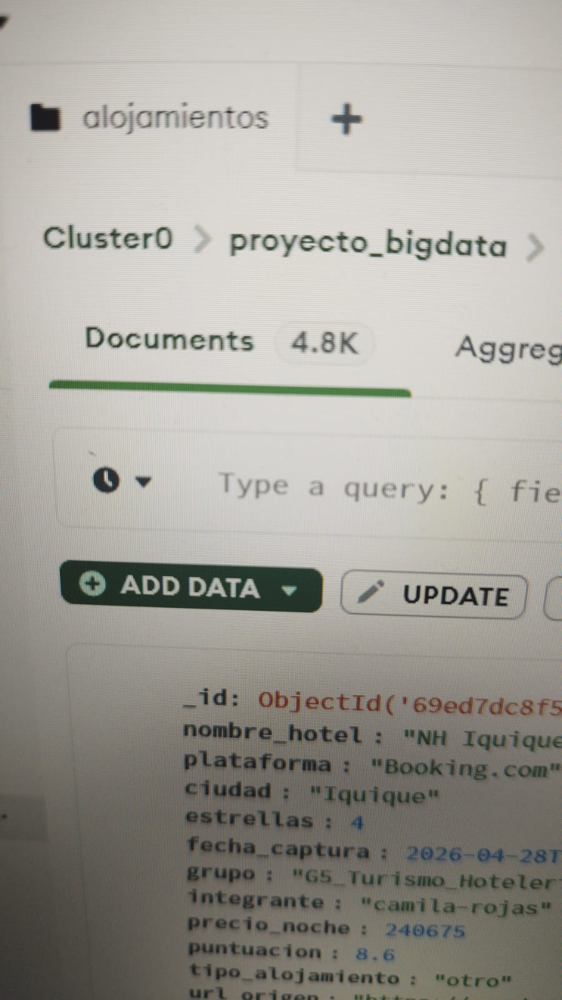
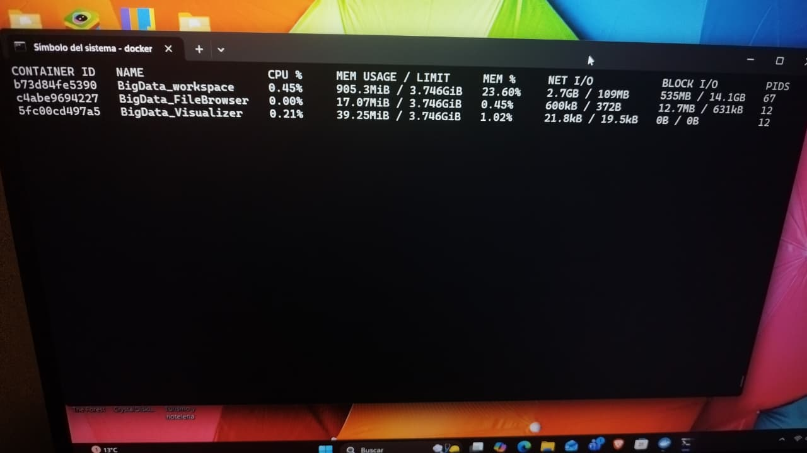

# BigData_IICG_2026_Actualizado Turismo y hosteleria 

# Proyecto Big Data Hito final

**Curso:** Big Data para la Toma de Decisiones
**Profesora:** Vannessa Duarte
**Grupo:** G5 - Turismo y Hotelería

---

## Integrantes y Roles Organizacionales

| Integrante | Plataforma | Rol | Nivel |
|------------|------------|-----|-------|
| Lucas Cheuque | Kayak.cl | Ingeniero de Datos - PySpark (Pipeline ETL) | **Nivel Táctico** |
| Camila Rojas | Booking.com | Científica de Datos - Modelamiento/Clustering | **Nivel Táctico** |
| Martina Cortés | HotelsCombined | Analista de BI - Tableros & Storytelling | **Nivel Estratégico** |
| Bastián Bravo | Google Hotels | Especialista en Ingesta - Scrapers | **Nivel Operativo** |
| Juan Pablo Salas | Trip.com | Especialista en Ingesta - Scrapers | **Nivel Operativo** |
| Angelo Rojo | Denomades.com | Especialista en Ingesta - Scrapers | **Nivel Operativo** |
| Matías González | Airbnb.cl | Documentación y Calidad de Datos | **Nivel Operativo** |

---

## Arquitectura del Proyecto

La arquitectura del sistema está diseñada para garantizar un flujo de datos escalable, desde la captura de información en plataformas de alojamiento hasta su visualización en un dashboard ejecutivo.

El ecosistema se despliega completamente en **Docker**, orquestando cinco contenedores que trabajan de forma integrada:

1. **BigData_workspace**  
   Contenedor principal basado en `jupyter/pyspark-notebook`. Aloja el entorno de desarrollo (Jupyter Lab) y contiene todas las librerías necesarias para el procesamiento distribuido con Apache Spark, scraping con Selenium, y visualización con Streamlit.

2. **BigData_Visualizer** (Mongo Express)  
   Interfaz web para la administración visual de la base de datos MongoDB. Permite consultar y validar los documentos almacenados sin necesidad de escribir comandos.

3. **BigData_FileBrowser** (FileBrowser)  
   Gestor de archivos dentro del contenedor, útil para revisar logs, CSVs y notebooks generados durante el proceso.

4. **MongoDB Atlas (Nube)**  
   Base de datos NoSQL utilizada como capa de persistencia. Todos los scrapers escriben aquí los datos extraídos, y Spark los consume desde este origen para su procesamiento.

5. **Streamlit (Interfaz de Usuario)**  
   Dashboard interactivo que consume los datos procesados y los KPIs calculados, presentándolos en tres niveles organizacionales (Estratégico, Táctico y Operacional) para la toma de decisiones.

---

##  Resumen de Indicadores Clave (KPIs)
**Métricas Generales:**

| Indicador | Valor |
|-----------|-------|
| Total de alojamientos | 3,584 |
| Precio promedio | $90,750 CLP |
| Puntuación promedio | 8.39 / 10 |
| Grupo 0 (oportunidad) | 42.8% |

---

**Distribución por Tipo de Alojamiento:**

| Tipo de Alojamiento | Cantidad | Precio Promedio (CLP) | Puntuación Promedio |
|---------------------|----------|----------------------|---------------------|
| apartamento | 416 | $83,634 | 8.32 |
| casa/cabaña | 385 | $89,940 | 8.37 |
| hostal | 818 | $47,521 | 8.36 |
| hotel | 1,965 | $110,410 | 8.42 |
**Interpretación de Negocio:**

- **Hoteles** dominan el mercado con 1,965 alojamientos (54.8% del total) y tienen el precio más alto ($110,410 CLP), lo que indica mayor margen potencial.
- **Hostales** son el formato más económico ($47,521 CLP) con 818 alojamientos, ideal para estrategias de volumen.
- **El Grupo 0 (42.8% del mercado)** representa la mayor oportunidad: alojamientos con precio bajo y buena puntuación.
- **La puntuación promedio es alta (8.39/10)**, lo que indica que el mercado chileno ofrece buena calidad general.

---
## Estructura del repositorio
proyecto-big-data-2026-equipo-de-turimos-y-hosteleria/
│
├── scrapers/                          # Scrapers por plataforma
│   ├── scraper_angelo_rojo.py        # Angelo Rojo (Denomades.com)
│   ├── scraper_bastian.py            # Bastián Bravo (Google Hotels)
│   ├── scraper_camila_rojas.py       # Camila Rojas (Booking.com)
│   ├── scraper_juan_salas.py         # Juan Pablo Salas (Trip.com)
│   ├── scraper_lucas_cheuque.py      # Lucas Cheuque (Kayak.cl)
│   ├── scraper_martina_cortes.py     # Martina Cortés (HotelsCombined)
│   └── scraper_matias_gonzalez.py    # Matías González (Airbnb.cl)
│
├── Turismo y hosteleria/              # Carpeta principal del proyecto
│   └── entrega_final/                 # Archivos de entrega final
│       ├── app.py                    # Dashboard Streamlit (versión final)
│       ├── datos_alojamientos_dashboard.csv  # Datos procesados
│       ├── Proyecto_Final.ipynb      # Informe final consolidado
│       ├── EDA_Alojamientos.ipynb
│       ├── Clustering_Alojamientos.ipynb
│       ├── Supervisado_Clasificacion.ipynb
│       ├── Supervisado_Regresion.ipynb
│       └── Storytelling_Alojamientos.ipynb
│
├── docker/                            # Configuración de contenedores
│   ├── Dockerfile                    # Configuración del contenedor
│   └── docker-compose.yml            # Orquestación de servicios
│
├── main.py                           # Orquestador de scrapers
├── README.md                         # Documentación del proyecto
└── start-vnc.sh                      # Script de inicio VNC

## Hito 2 De Análisis Inteligente y Segmentación

### Aportes
| Estudiante | Responsabilidad | Rama |
|---|---|---|
| Camila Rojas | Modelado No Supervisado: K-Means, Método del Codo, interpretación de clústeres | feature/Camila-rojas |
| Martina Cortés | Análisis Descriptivo (EDA) | feature/martina-cortes |
| Bastian Bravo | Scraping y Captura de Datos | feature/bastian-bravo |
| Lucas Cheuque | Ingeniería de Datos y Pipeline | feature/Lucas-Cheuque |
| Juan Pablo Salas | Scraping y Captura de Datos | feature/juan-Salas |
| Angelo Rojo | Scraping y Captura de Datos | feature/Angelo-Rojo |
| Matias Gonzalez | Documentación y Calidad | feature/matias-gonzalez |

### Notebooks Entrega 2
- Refinamiento de Datos y EDA
- Aprendizaje No Supervisado (Clustering)
- Supervisado Regresión
- Supervisado Clasificación
- Proyecto

Recomendacion de alojamiento en chile: 
Scraping de precios de las principales plataformas de alojamiento que operan en Chile, centralizado en MongoDB Atlas para apoyar lad decisiones de los turista.

Problemática:
Cuando un turista busca alojamiento en Chile, debe revisar varias plataformas por separado para intentar encontrar la mejor opción. El problema es que los precios varían considerablemente entre plataformas para el mismo destino y ciudad, y no existe una forma simple de entender esas diferencias. Si bien existen comparadores como Trivago o Google Hotels, estos están orientados a la reserva directa y no permiten analizar el comportamiento real del mercado de alojamiento chileno. Tampoco muestran diferencias por zona geográfica ni distinguen el tipo de alojamiento que se está evaluando. Las agencias de turismo y los propios establecimientos tampoco cuentan con información estructurada para entender cómo varían los precios entre plataformas y ciudades, lo que dificulta tomar decisiones informadas.

Propuesta de Valor:
La idea es usar scraping para extraer precios de alojamientos desde las principales plataformas que operan en Chile, como Booking,Kayak, Airbnb, Hotelscombined. Centralizando toda esa información en una base de datos en MongoDB. Con esto se podrá sugerir al turista cuál plataforma ofrece mejores opciones según el destino que quiere visitar, considerando la zona geográfica del país, ya sea Norte, Centro o Sur de Chile. El objetivo no es solo guardar datos, sino poder responder con información real a preguntas como: ¿en qué plataforma conviene buscar alojamiento en Santiago?, ¿qué zona ofrece mejor relación precio-calidad?, ¿cuál es el rango de precios promedio según el tipo de alojamiento y ciudad? De esta forma el sistema se convierte en una herramienta de apoyo para la decisión del turista.

Análisis de las 4V:

Volumen: Se necesitan más de 3.000 registros porque el precio de un alojamiento no es un dato único, varía según la ciudad, la plataforma, la zona geográfica y la categoría del establecimiento. Con una muestra pequeña, la mayoría de los datos probablemente serían de Santiago y no representarían el mercado de alojamiento del resto del país. Con 500 registros por integrante se logra una distribución suficiente entre ciudades del Norte, Centro y Sur de Chile para que las sugerencias tengan validez estadística.

Variedad: El precio solo no alcanza para sugerir alojamientos de forma justa. Un hotel cinco estrellas, un hostal o un departamento pueden aparecer en la misma búsqueda pero no son comparables. Por eso se extraen 8 etiquetas: nombre del alojamiento, precio por noche, ciudad, estrellas, tipo de alojamiento, puntuación, fecha de captura y URL de origen. Cada una aporta el contexto necesario para que la sugerencia sea relevante y útil para el turista.

Veracidad: Para asegurar que los datos capturados sean confiables, los precios se guardan como valores numéricos descartando símbolos de moneda o caracteres extraños. Se eliminan registros con campos vacíos o precios iguales a cero. Cada registro incluye la URL exacta de donde se extrajo la información, permitiendo verificar el origen del dato en cualquier momento. Además, si un alojamiento ya existe en la base de datos, el sistema actualiza su precio en lugar de crear un duplicado, manteniendo la información limpia y confiable.

Velocidad: Los precios de alojamiento cambian constantemente, por lo que los datos capturados representan el momento exacto en que se ejecutó el scraper. Si en algún momento se necesita actualizar la información, el scraper puede volver a ejecutarse sin problema, ya que está diseñado para actualizar precios existentes en vez de crear registros nuevos, garantizando que la sugerencia que recibe el turista esté siempre basada en datos actuales.

Hitos 1 infraestructura y captura de datos 

Comando para ejecutar:
docker-compose up -d
Tabla de Atributos por Integrante

| Integrante | Plataforma | Etiquetas extraídas |
|---|---|---|
| Camila Rojas | Booking.com | nombre_hotel, precio_noche, ciudad, zona_geografica, estrellas, tipo_alojamiento, puntuacion, fecha_captura, url_origen, plataforma, integrante |
| Matías González | Airbnb | nombre_hotel, precio_noche, ciudad, zona_geografica, estrellas, tipo_alojamiento, puntuacion, fecha_captura, url_origen, plataforma, integrante |
| Lucas Cheuque | Kayak | nombre_hotel, precio_noche, ciudad, zona_geografica, estrellas, tipo_alojamiento, puntuacion, fecha_captura, url_origen, plataforma, integrante |
| Martina Cortés | HotelsCombined | nombre_hotel, precio_noche, ciudad, zona_geografica, estrellas, tipo_alojamiento, puntuacion, fecha_captura, url_origen, plataforma, integrante |
| Angelo Rojo | Denomades | nombre_hotel, precio_noche, ciudad, zona_geografica, estrellas, tipo_alojamiento, puntuacion, fecha_captura, url_origen, plataforma, integrante |
| Bastián Bravo | Google Hotels | nombre_hotel, precio_noche, ciudad, zona_geografica, estrellas, tipo_alojamiento, puntuacion, fecha_captura, url_origen, plataforma, integrante |
| Juan Pablo Salas | Trip.com | nombre_hotel, precio_noche, ciudad, zona_geografica, estrellas, tipo_alojamiento, puntuacion, fecha_captura, url_origen, plataforma, integrante |

Evidencia 1 - Docker Stats

Evidencia 2 - MongoDB Count

